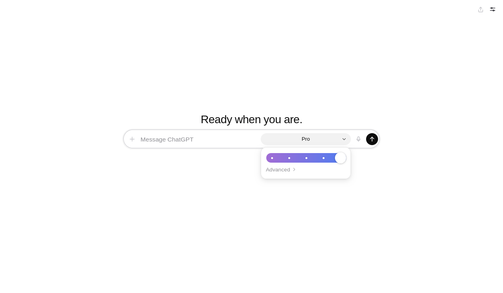

# chatgpt-chat-webui



A **ChatGPT web UI** for
[`chatgpt-chat-api`](https://github.com/QuixThe2nd/chatgpt-chat-api).

This repo is the browser UI: same process, same origin, no CDN.

Unofficial. Not affiliated with OpenAI.

## Requirements

- Linux ChatGPT desktop app, installed and signed in
- [`chatgpt-chat-api`](https://github.com/QuixThe2nd/chatgpt-chat-api) (not on PyPI)
- Python 3.11+

## Install and run

```bash
pip install "chatgpt-chat-api @ git+https://github.com/QuixThe2nd/chatgpt-chat-api.git"
pip install -e .

chatgpt-chat-webui
```

Open `http://127.0.0.1:8317/`. Default bind is loopback. There is **no
login on this server** — only bind interfaces you trust
(`CHATGPT_API_HOST` / `CHATGPT_API_PORT`).

## What you get

- Chat transcript, composer, model list from `GET /v1/models`
- Effort / power control (Instant → Pro) on the composer
- Streaming replies with Stop, New chat, settings (health, reload models, SSE toggle)
- Same-origin only: the page talks to the process that served it

Attach, voice, and share are shown disabled. They are not implemented.

Replies are plain text (`textContent`). Nothing is stored in cookies or
browser storage; reload clears the thread.

## Tests

```bash
python3 -m venv .venv
.venv/bin/pip install "chatgpt-chat-api @ git+https://github.com/QuixThe2nd/chatgpt-chat-api.git"
.venv/bin/pip install -e ".[test]"
.venv/bin/pytest -q
```

No desktop app or network required at test time (in-memory fake backend).
